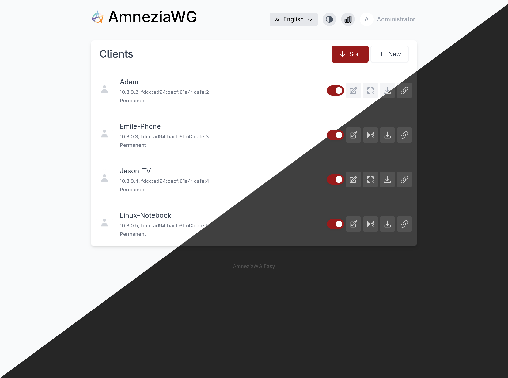

# WireGuard Easy

[](https://github.com/wg-easy/wg-easy/actions/workflows/deploy.yml)
[](https://github.com/wg-easy/wg-easy/actions/workflows/lint.yml)

[](https://github.com/sponsors/WeeJeWel)


You have found the easiest way to install & manage WireGuard on any Linux host!

<p align="center">
  
</p>

## Features

* All-in-one: WireGuard + Web UI.
* Easy installation, simple to use.
* List, create, edit, delete, enable & disable clients.
* Show a client's QR code.
* Download a client's configuration file.
* Statistics for which clients are connected.
* Tx/Rx charts for each connected client.
* Gravatar support.
* Automatic Light / Dark Mode

## Requirements

* A host with a kernel that supports WireGuard (all modern kernels).
* A host with Docker installed.

## Installation

### 1. Install Docker

If you haven't installed Docker yet, install it by running:

```bash
$ curl -sSL https://get.docker.com | sh
$ sudo usermod -aG docker $(whoami)
$ exit
```

And log in again.

### 2. Run WireGuard Easy

To automatically install & run wg-easy, simply run:

<pre>
$ docker run -d \
  --name=wg-easy \
  -e WG_HOST=<b>🚨YOUR_SERVER_IP</b> \
  -e PASSWORD=<b>🚨YOUR_ADMIN_PASSWORD</b> \
  -v ~/.wg-easy:/etc/wireguard \
  -p 51820:51820/udp \
  -p 51821:51821/tcp \
  --cap-add=NET_ADMIN \
  --cap-add=SYS_MODULE \
  --sysctl="net.ipv4.conf.all.src_valid_mark=1" \
  --sysctl="net.ipv4.ip_forward=1" \
  --restart unless-stopped \
  ghcr.io/wg-easy/wg-easy
</pre>

> 💡 Replace `YOUR_SERVER_IP` with your WAN IP, or a Dynamic DNS hostname.
>
> 💡 Replace `YOUR_ADMIN_PASSWORD` with a password to log in on the Web UI.

The Web UI will now be available on `http://0.0.0.0:51821`.

> 💡 Your configuration files will be saved in `~/.wg-easy`

### 3. Sponsor

Are you enjoying this project? [Buy Emile a beer!](https://github.com/sponsors/WeeJeWel) 🍻

## Options

These options can be configured by setting environment variables using `-e KEY="VALUE"` in the `docker run` command.

| Env | Default | Example | Description |
| - | - | - | - |
| `PORT` | `51821` | `6789` | TCP port for Web UI. |
| `WEBUI_HOST` | `0.0.0.0` | `localhost` | IP address web UI binds to. |
| `PASSWORD` | - | `foobar123` | When set, requires a password when logging in to the Web UI. |
| `WG_HOST` | - | `vpn.myserver.com` | The public hostname of your VPN server. |
| `WG_DEVICE` | `eth0` | `ens6f0` | Ethernet device the wireguard traffic should be forwarded through. |
| `WG_PORT` | `51820` | `12345` | The public UDP port of your VPN server. WireGuard will always listen on 51820 inside the Docker container. |
| `WG_MTU` | `null` | `1420` | The MTU the clients will use. Server uses default WG MTU. |
| `WG_PERSISTENT_KEEPALIVE` | `0` | `25` | Value in seconds to keep the "connection" open. If this value is 0, then connections won't be kept alive. |
| `WG_DEFAULT_ADDRESS` | `10.8.0.x` | `10.6.0.x` | Clients IP address range. |
| `WG_DEFAULT_DNS` | `1.1.1.1` | `8.8.8.8, 8.8.4.4` | DNS server clients will use. If set to blank value, clients will not use any DNS. |
| `WG_ALLOWED_IPS` | `0.0.0.0/0, ::/0` | `192.168.15.0/24, 10.0.1.0/24` | Allowed IPs clients will use. |
| `WG_PRE_UP` | `...` | - | See [config.js](https://github.com/wg-easy/wg-easy/blob/master/src/config.js#L19) for the default value. |
| `WG_POST_UP` | `...` | `iptables ...` | See [config.js](https://github.com/wg-easy/wg-easy/blob/master/src/config.js#L20) for the default value. |
| `WG_PRE_DOWN` | `...` | - | See [config.js](https://github.com/wg-easy/wg-easy/blob/master/src/config.js#L27) for the default value. |
| `WG_POST_DOWN` | `...` | `iptables ...` | See [config.js](https://github.com/wg-easy/wg-easy/blob/master/src/config.js#L28) for the default value. |

> If you change `WG_PORT`, make sure to also change the exposed port.

## Updating

To update to the latest version, simply run:

```bash
docker stop wg-easy
docker rm wg-easy
docker pull ghcr.io/wg-easy/wg-easy
```

And then run the `docker run -d \ ...` command above again.

## Common Use Cases

* [Using WireGuard-Easy with Pi-Hole](https://github.com/wg-easy/wg-easy/wiki/Using-WireGuard-Easy-with-Pi-Hole)
* [Using WireGuard-Easy with nginx/SSL](https://github.com/wg-easy/wg-easy/wiki/Using-WireGuard-Easy-with-nginx-SSL)

For less common or specific edge-case scenarios, please refer to the detailed information provided in the [Wiki](https://github.com/wg-easy/wg-easy/wiki).
