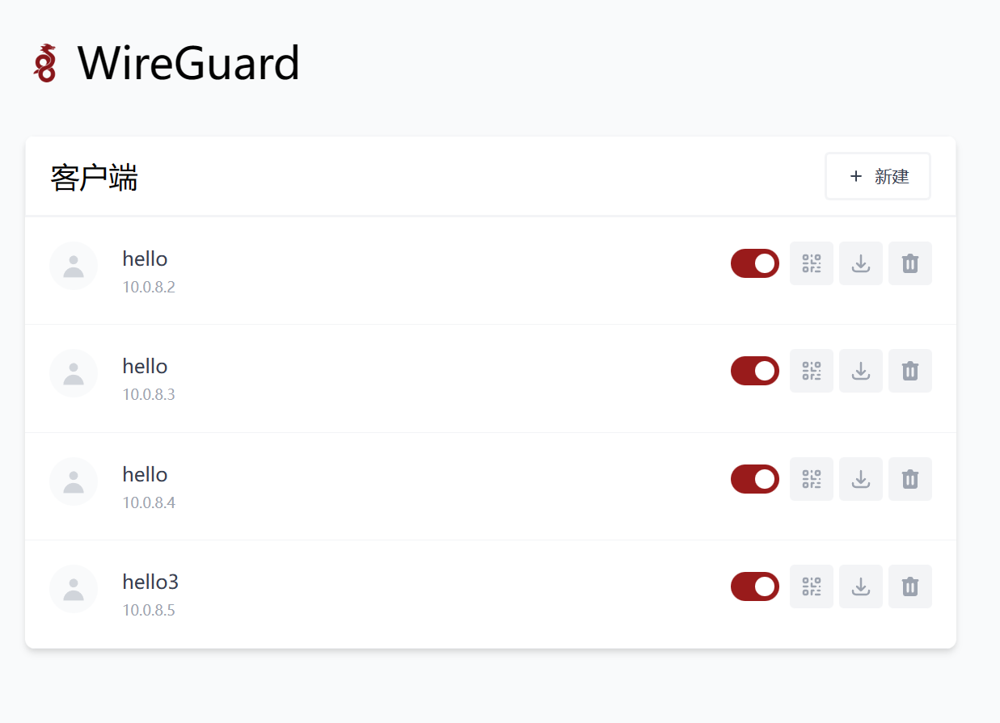

# WireGuard Easy

您已经找到了在任何Linux主机上安装和管理WireGuard的最简单方法！

<p align="center">
  
</p>

## 功能

* 中文 WireGuard web UI
* 非常简单安装
* 很轻松的查看，删除、添加、扫描二维码。
* 可以看到客户端 QR 代码.
* 可以下载客户端的配置文件
* 客户端连接的统计信息
* Tx/Rx 每个连接的客户端的图表。
* 支持头像.

## 要求

* 具有支持 WireGuard（所有现代内核）内核的主机。
* 安装了 Docker 的主机。

## 安装它

### 1. 安装Docker

如果你还没有安装docker 那么你是用下面命令安装:

```bash
$ curl -sSL https://get.docker.com | sh
$ sudo usermod -aG docker $(whoami)
$ exit
```

然后重新登录。.

### 2. 很轻松的运行 WireGuard 

要自动安装和运行wg-easy，只需运行

<pre>
$ docker run -d \
  --name=wg-easy \
  -e WG_HOST=<b>🚨你的服务器IP地址</b> \
  -e PASSWORD=<b>🚨你的 WireGuard 登录密码</b> \
  -v /opt/wg-easy:/etc/wireguard \
  -p 51820:51820/udp \
  -p 51821:51821/tcp \
  --cap-add=NET_ADMIN \
  --cap-add=SYS_MODULE \
  --sysctl="net.ipv4.conf.all.src_valid_mark=1" \
  --sysctl="net.ipv4.ip_forward=1" \
  --restart unless-stopped \
  weejewel/wg-easy
</pre>

> 访问你的 web UI `http://服务器地址:51821`.

> 💡 你的配置文件在 `/opt/wg-easy`

## 选项

这些选项可以通过使用以下方法设置环境变量来配置。 `-e KEY="VALUE"` 在 `docker run` 命令.

| Env                       | Default           | Example                        | Description                              |
| ------------------------- | ----------------- | ------------------------------ | ---------------------------------------- |
| `PASSWORD`                | -                 | `foobar123`                    | 设置后，登录 Web UI 时需要密码。                     |
| `WG_HOST`                 | -                 | `vpn.myserver.com`             | VPN 服务器的公共主机名。                           |
| `WG_PORT`                 | `51820`           | `12345`                        | VPN 服务器的公共 UDP 端口。WireGuard 将始终侦听 Docker 容器内的 51820。 |
| `WG_MTU`                  | `null`            | `1420`                         | 客户端将使用的 MTU。服务器使用默认的 WG MTU。             |
| `WG_PERSISTENT_KEEPALIVE` | `0`               | `25`                           | 以秒为单位的值，以保持“连接”打开。如果此值为 0，则连接不会保持活动状态。   |
| `WG_DEFAULT_ADDRESS`      | `10.8.0.x`        | `10.6.0.x`                     | 客户端 IP 地址范围。                             |
| `WG_DEFAULT_DNS`          | `1.1.1.1`         | `8.8.8.8, 8.8.4.4`             | DNS 设置                                   |
| `WG_ALLOWED_IPS`          | `0.0.0.0/0, ::/0` | `192.168.15.0/24, 10.0.1.0/24` | 客户端将使用的允许 IP。                            |
| `WG_PRE_UP`               | `...`             | -                              | 有关默认值，请参阅 [config.js](https://github.com/WeeJeWel/wg-easy/blob/master/src/config.js#L19) |
| `WG_POST_UP`              | `...`             | `iptables ...`                 | 有关默认值，请参阅 [config.js](https://github.com/WeeJeWel/wg-easy/blob/master/src/config.js#L19) |
| `WG_PRE_DOWN`             | `...`             | -                              | 有关默认值，请参阅 [config.js](https://github.com/WeeJeWel/wg-easy/blob/master/src/config.js#L19) |
| `WG_POST_DOWN`            | `...`             | `iptables ...`                 | 有关默认值，请参阅 [config.js](https://github.com/WeeJeWel/wg-easy/blob/master/src/config.js#L19) |

> 如果更改`WG_PORT`，请确保同时更改公开的端口。

## 更新

要更新到最新版本，只需运行

```bash
docker stop wg-easy
docker rm wg-easy
docker pull weejewel/wg-easy

docker run -d \
  --name=wg-easy \
  -e WG_HOST=<b>🚨你的服务器IP地址</b> \
  -e PASSWORD=<b>🚨你的 WireGuard 登录密码</b> \
  -v /opt/wg-easy:/etc/wireguard \
  -p 51820:51820/udp \
  -p 51821:51821/tcp \
  --cap-add=NET_ADMIN \
  --cap-add=SYS_MODULE \
  --sysctl="net.ipv4.conf.all.src_valid_mark=1" \
  --sysctl="net.ipv4.ip_forward=1" \
  --restart unless-stopped \
  weejewel/wg-easy

```


## 参考

[WeeJeWel/wg-easy: The easiest way to run WireGuard VPN + Web-based Admin UI. (github.com)](https://github.com/WeeJeWel/wg-easy)


* [Using WireGuard-Easy with Pi-Hole](https://github.com/WeeJeWel/wg-easy/wiki/Using-WireGuard-Easy-with-Pi-Hole)
* [Using WireGuard-Easy with nginx/SSL](https://github.com/WeeJeWel/wg-easy/wiki/Using-WireGuard-Easy-with-nginx-SSL)
